# Every market, every method — the map

**Written 2026-09-22.** One tree. The root is the question ("is there an automated path from
$5,000 to $50,000?"), each branch is a market or mechanism, each leaf is a measurement this
repo made, a recorder it is running, or a stated reason it cannot be measured from here.
Nothing on this page is an opinion; every leaf names its file.

```mermaid
flowchart TD
  Q[$5k to $50k, automated?] --> EQ[US equities]
  Q --> OPT[Options]
  Q --> CR[Crypto]
  Q --> PM[Prediction markets]
  Q --> X[Not reachable from a US retail account]

  EQ --> EQ1[Intraday index direction<br/>340k tests, 1,919 sessions: NULL]
  EQ --> EQ2[Weekly single-name direction<br/>24 predictors, 214,803 name-weeks: NULL ~52%]
  EQ --> EQ3[Stat-arb residual reversion<br/>1,500 names, Avellaneda-Lee: see statarb.md]
  EQ --> EQ4[Quarterly factors<br/>earnings surprise +2.84% Q5-Q1 @63d, t 4.3: REAL]
  EQ --> EQ5[Index overlay<br/>2x + VIX backwardation: 15%/yr, DD 59%: REAL, slow]
  EQ --> EQ6[Buyback / FCF tilt<br/>t 3.5, regime-dependent]
  EQ --> EQ7[Information diffusion, 6 channels<br/>498,734 name-weeks: NULL; combined model -9%/yr net]

  OPT --> O1[0DTE credit structures<br/>147,350 real trades: ALL NEGATIVE]
  OPT --> O2[Weekly verticals on a signal<br/>67,380 real trades: -8.4% credit / -14.5% debit per trade]
  OPT --> O3[Monthly put-write / covered call<br/>4-8%/yr, all below SPY]
  OPT --> O4[Earnings straddles / VRP<br/>-35%; premium edge NOT reproduced in P&L]
  OPT --> O5[Far-OTM lottery<br/>10.5M purchases: -48 to -90%]
  OPT --> O6[Vendor flow / unusual activity<br/>2 years own history: NULL]

  CR --> C1[Cross-exchange arbitrage<br/>47% of checks show a gap, max 5 bp, 0 beat fees]
  CR --> C2[Memecoin launch sniping<br/>RECORDING; literature: 69% die day one, <2% graduate]
  CR --> C3[Funding-rate carry<br/>8-20%/yr in positive regimes; venues closed to US]
  CR --> C4[MEV / on-chain<br/>validator-ordered; retail is last in queue]
  CR --> C5[Grid / DCA / signal bots<br/>short volatility wearing a bot]

  PM --> P1[Polymarket 5-min crypto vs spot<br/>RECORDING; mechanism is oracle latency; 1.56% taker fee at 50/50]
  PM --> P2[Polymarket vs Kalshi cross-venue<br/>RECORDING: sub-$1 two-leg on 11% of ticks, last 2 min, ~1-3c on ~100 contracts; venues resolve on DIFFERENT references]
  PM --> P3[Sports arbitrage / matched betting<br/>books limit winners; not an investment]

  X --> X1[HFT / co-located latency<br/>3-10 ms leads; retail is 30-100 ms]
  X --> X2[Non-public information<br/>a crime; not sought]
  X --> X3[Copy trading / social leaders<br/>survivorship; the losers are not visible]
```

## The trunk: what the numbers say

The only leaves that measured a positive, repeatable return are slow stock effects and
the index overlay, and together they compound at roughly **15–20% a year at 2×** with a
**50–60% drawdown**. Everything fast is one of three shapes: a coin flip paying a toll, a gap
smaller than the fee to cross it, or a short-volatility position that pays until it does
not. `02_findings/online_methods.md` is the table; this page is the tree and the sources.

## Branch: US equities

- **Intraday direction.** `02_findings/INTRADAY_DIRECTION.md`, `FINDINGS.md`. Every
  indicator, pattern, opening-range, VWAP fade, gamma-conditioned scalp: null after spread.
  The lead-lag literature (Budish 2015, Hasbrouck 2003, Bangsgaard & Kokholm 2024) puts the
  exploitable horizon at milliseconds. Vendor signed flow (`uw_flow.md`): 1–2 bp a trade.
- **Weekly direction.** `weekly_predictors.md`. Cremers-Weinbaum, the smirk, IV changes,
  reversal, momentum, 52-week high, borrow fee: none clear the noise bar; a composite is
  right 52%.
- **Statistical arbitrage.** `05_studies/statarb_test.py`: 60-day factor residuals on 12
  ETFs, OU s-scores, long/short deciles, 1/3/5-day holds, 5 bp a side. Result in
  `02_findings/statarb.md` once run — this is the canonical hedge-fund equity trade and the
  one "quant math" leaf that was untested.
- **Quarterly factors.** `fundamentals.md`: earnings-surprise drift is the strongest single
  effect found (+2.84% Q5−Q1 over 63 sessions, all splits); capital return real in 2022–23,
  flat since. Live as the stock book (`swing_stock.py`).
- **Index overlay.** `goal_feasibility.md`: the best growth path measured.

## Branch: options

All in `WHAT_FAILED.md`, `weekly_structure.md`, `online_methods.md`. The one new leaf tonight:
monthly put-writing on real quotes is a smooth 4–5% a year (15-delta: Sharpe 2.1, max
drawdown −3.3%) and covered calls 7.6%, both below SPY's 10% over the same months. Income,
not growth.

## Branch: crypto

- **Cross-exchange arbitrage.** Measured live (`crypto_venue_recorder.py`, keep-alive):
  1,182 raw gaps in 2,496 checks, largest 5.2 bp, **zero** beat the two taker fees. The
  recorder keeps counting.
- **Memecoin launches.** `memecoin_recorder.py` records every token on DexScreener's launch
  feed at first sight and re-prices it for 24 h; `memecoin_score.py` reports the return
  distribution including the rugs. The literature it will be checked against: 68.67% of
  pump.fun tokens record their last trade on launch day and 4.55% survive 90 days
  ([CoinGecko](https://www.coingecko.com/research/publications/average-lifespan-of-pumpfun-tokens));
  0.63% graduated in a 655,770-token Sep–Oct 2025 sample
  ([arXiv 2607.02823](https://arxiv.org/pdf/2607.02823)); under 50% of traders profitable in
  most months, 30% in June 2025 ([arXiv 2512.11850](https://arxiv.org/pdf/2512.11850));
  200-plus bots compete in the first half-second of a launch
  ([Dysnix](https://dysnix.com/blog/top-solana-sniper-bot)). The first Solana launch the
  recorder pulled was 20 minutes old, $3,500 of liquidity, down 92%.
- **Funding-rate carry.** The one crypto yield with a real mechanism: 8–20% a year in
  sustained positive funding, 0–5% sideways, one walk-forward repo reports 4.3% for 2025–26
  ([funding-rate-arb](https://github.com/zwmjj/funding-rate-arb), BIS WP 1087). The venues
  that pay it are closed to US persons; Robinhood has no perpetuals. Not 10× anyway.
- **MEV, grid bots, copy trading.** Placed, not measured: see `online_methods.md`.

## Branch: prediction markets

- **Polymarket 5-minute crypto.** `polymarket_recorder.py` logs the YES book against spot
  every 3 s and each window's resolution; `polymarket_score.py` gives the calibration by
  seconds-left × spot move and the "buy the side ahead" trade. What the public writing says
  the edge IS: bots read the Chainlink BTC/USD stream directly and know the resolution 2–15
  seconds before the market updates ([Benjamin-Cup](https://medium.com/@benjamin.bigdev/building-a-high-probability-trading-bot-for-polymarkets-5-minute-btc-market-55bce0f47979),
  [CoinDesk 2026-02-21](https://www.coindesk.com/markets/2026/02/21/how-ai-is-helping-retail-traders-exploit-prediction-market-glitches-to-make-easy-money)),
  and Polymarket answered in January 2026 with a dynamic taker fee peaking at **1.56% at
  50/50**. So the trade is oracle latency against a fee larger than the spread, and the
  recorder's last-30-second cell will show what is left of it at 3-second polling.
- **Polymarket vs Kalshi.** `kalshi_recorder.py` pairs the same 15-minute BTC window on
  both venues. First five hours (21 windows): the mids agree to the cent; a YES-on-one,
  NO-on-the-other position costs under $1.00 after both fees on 11% of ticks, nearly all in
  the last two minutes, and settled at what it actually paid those ticks average +1.4c per
  dollar pair on ~100 contracts of depth. The catch found by reading both rulebooks: Kalshi
  settles on a CF Benchmarks 60-second average against a 60-second average at the open;
  Polymarket on a Chainlink TWAP against the Chainlink PRICE at the open. Different index,
  different start reference, so the "locked dollar" can pay 0 or 2 when BTC ends near where
  it began. The recorder now records each window's result on both venues; 0 of 20 disagreed
  so far. Even if the disagreement rate stays low it is a few dollars per window on a venue a
  US person cannot open.
- **Sports.** Not an investment: books limit winning accounts within weeks.

## Branch: the "bot" genre itself

TRM Labs counted nine fake "build a crypto arbitrage bot with Claude" tutorials that
drained 274.6 ETH (~$517,000) from 224 people between February and August 2026; the code
in the tutorials was a wallet drainer
([AirdropAlert](https://airdropalert.com/blogs/claude-trading-bot-scam/)). The "$68 to
$750,000, follow for the setup" post has the same shape: a dashboard graphic, an exponential
curve, and a DM funnel. The dashboard I was shown carries a "confidence" score, a "streak
multiplier" and a 10 ms latency, none of which is a real number.

## What is running right now, unattended

| recorder | what | scored by |
|---|---|---|
| `crypto_venue_recorder.py` | BTC/ETH best bid/ask on 4 venues every 2 s; every crossing net of fees | `polymarket_score.py` (tail) |
| `polymarket_recorder.py` | 5-min BTC/ETH/SOL YES book vs spot every 3 s; resolutions | `polymarket_score.py` |
| `memecoin_recorder.py` | every DexScreener launch at first sight; re-priced for 24 h | `memecoin_score.py` |
| `kalshi_recorder.py` | the same 15-min BTC window on Kalshi and Polymarket every 5 s, both books, two-leg cost after both fees; each window's RESULT on both venues once it closes | `kalshi_score.py` |
| `swing_stock.py` (daily) | the earnings-surprise stock book and its ledger | its own panel |

All under `com.daytrading.recorders` (keep-alive) and the 5-minute refresh cycle. None of
them can place an order.
